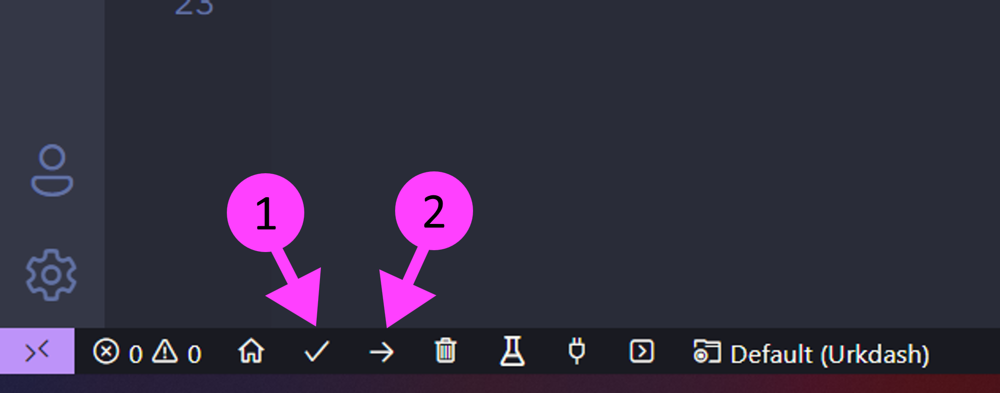

# Urkdash 🦉

[](https://github.com/Urkdash/urkdash-arduino/releases/tag/v1.1)
[](https://img.shields.io/badge/license-LGPL2.1-blue)
[](https://img.shields.io/badge/language-c++-red)

This library provides a way to connect to [Urkdash](https://urkdash.com) as easy as possible.

## Installation ⚙️

### Arduino IDE

1. Fork/Clone/Download this repo

    `git clone https://github.com/Urkdash/urkdash-arduino.git`
    
2. Navigate to your Arduino/libraries folder
3. Unzip the .zip file 
4. Create a new Arduino project
5. Import the library `#include <urkdash.h>` at top of your Arduino Code.
6. Code and enjoy your IoT Projects!

Disclaimer: **Currently this library depends on three other libraries [PubSubClient](https://github.com/knolleary/pubsubclient), [NTPClient](https://github.com/arduino-libraries/NTPClient), and [ArduinoJSON](https://github.com/bblanchon/ArduinoJson). You need to download those libraries as well.**


### PlatformIO (VScode)

1. Install PlatformIO on VScode

<p align="center">

</p>

2. Open PlatformIO

<p align="center">

</p>

3. Create a new PlatformIO project and select a ESP32 or ESP8266 Board

<p align="center">

</p>

4. Copy the `platformio.ini` of this [library](https://github.com/Urkdash/urkdash-arduino/blob/main/platformio.ini)

<p align="center">

</p>

5. Build the project

<p align="center">

</p>

6. Import the libraries
7. Code and enjoy your IoT Projects!
    
## Examples

The library comes with a number of example sketches. See [examples](https://github.com/Urkdash/urkdash-arduino/tree/main/examples)
within the Arduino application.

<h3>Sending Data</h3>

```
// Libraries
#include <Arduino.h>
#include <WiFi.h>
#include <urkdash.h>

const char *wifi_ssid = "YOUR_SSID";         // your network SSID (name)
const char *wifi_password = "YOUR_PASSWORD"; // your network password

String dev_id = "REPLACE_WITH_YOUR_DEVICE_ID";                 // your device id
String webhook_password = "REPLACE_WITH_YOUR_DEVICE_PASSWORD"; // your device password

Urkdash dash;

void setup_wifi();
void data();

void setup_wifi()
{
  Serial.print("\n\n\nWiFi Connection in Progress");
  WiFi.mode(WIFI_STA);

  WiFi.begin(wifi_ssid, wifi_password);

  int counter = 0;

  while (WiFi.status() != WL_CONNECTED)
  {
      delay(500);
      Serial.print(".");
      counter++;

      if (counter > 10)
      {
          Serial.print("  ⤵");
          Serial.print("\n\n         Ups WiFi Connection Failed :( ");
          Serial.println(" -> Restarting...");
          delay(2000);
          ESP.restart();
      }

        Serial.print("  ⤵");
    }
  
  // Print the IP address
  Serial.println("\n\n         WiFi Connection -> SUCCESS :)");
  Serial.print("\n         Local IP -> ");
  Serial.print(WiFi.localIP());

  // Print WiFi Signal Quality Strength
  Serial.print("\n         WiFi Intensity -> ");
  Serial.print(WiFi.RSSI());
  Serial.print(" dBm");
}

void setup()
{
  Serial.begin(9600);                               // Serial Monitor Begin
  setup_wifi();                                     // setup wifi connection
  dash.setup_credentials(dev_id, webhook_password); // Setup Credentials
}

void loop()
{
  data();                       // get data from the dashboard
  dash.check_mqtt_connection(); // check mqtt connection
}

void data()
{
  // Data example
  int temp = random(0, 100);
  int hum = random(0, 100);

  // Send data to dashboard
  dash.send_data(0, true, String(temp));
  dash.send_data(1, true, String(hum));
}
```

<h3>Receiving Data</h3>

```
// Libraries
#include <Arduino.h>
#include <WiFi.h>
#include <urkdash.h>

#define LED_PIN 2

const char *wifi_ssid = "YOUR_SSID";         // your network SSID (name)
const char *wifi_password = "YOUR_PASSWORD"; // your network password

String dev_id = "REPLACE_WITH_YOUR_DEVICE_ID";                 // your device id
String webhook_password = "REPLACE_WITH_YOUR_DEVICE_PASSWORD"; // your device password

Urkdash dash;

void setup_wifi();
void data();

void setup_wifi()
{
  Serial.print("\n\n\nWiFi Connection in Progress");
  WiFi.mode(WIFI_STA);

  WiFi.begin(wifi_ssid, wifi_password);

  int counter = 0;

  while (WiFi.status() != WL_CONNECTED)
  {
      delay(500);
      Serial.print(".");
      counter++;

      if (counter > 10)
      {
          Serial.print("  ⤵");
          Serial.print("\n\n         Ups WiFi Connection Failed :( ");
          Serial.println(" -> Restarting...");
          delay(2000);
          ESP.restart();
      }

        Serial.print("  ⤵");
    }
  
  // Print the IP address
  Serial.println("\n\n         WiFi Connection -> SUCCESS :)");
  Serial.print("\n         Local IP -> ");
  Serial.print(WiFi.localIP());

  // Print WiFi Signal Quality Strength
  Serial.print("\n         WiFi Intensity -> ");
  Serial.print(WiFi.RSSI());
  Serial.print(" dBm");
}

void setup()
{
  Serial.begin(9600);                               // Serial Monitor Begin
  setup_wifi();                                     // setup wifi connection
  pinMode(LED_PIN, OUTPUT);
  dash.setup_credentials(dev_id, webhook_password); // Setup Credentials
}

void loop()
{
  data();                       // get data from the dashboard
  dash.check_mqtt_connection(); // check mqtt connection
}

void data()
{
    // BUTTON
    // Receiving data from the first widget
    if (dash.receive_data(0) == "restart")
    {
        Serial.println("Restarting...");
        delay(2000);
        ESP.restart();
    }

    // SWITCH
    // Receiving data from the second widget
    if (dash.receive_data(1) == "true")
    {
        Serial.println("Turning on LED...");
        delay(2000);
        digitalWrite(LED_PIN, HIGH);
    }
    else if (dash.receive_data(1) == "false")
    {
        Serial.println("Turning off LED...");
        delay(2000);
        digitalWrite(LED_PIN, LOW);
    }
}
```
<h3>Sending and Receiving Data</h3>

```
// Libraries
#include <Arduino.h>
#include <WiFi.h>
#include <urkdash.h>

#define LED_PIN 2

const char *wifi_ssid = "YOUR_SSID";         // your network SSID (name)
const char *wifi_password = "YOUR_PASSWORD"; // your network password

String dev_id = "REPLACE_WITH_YOUR_DEVICE_ID";                 // your device id
String webhook_password = "REPLACE_WITH_YOUR_DEVICE_PASSWORD"; // your device password

Urkdash dash;

void setup_wifi();
void data();

void setup_wifi()
{
  Serial.print("\n\n\nWiFi Connection in Progress");
  WiFi.mode(WIFI_STA);

  WiFi.begin(wifi_ssid, wifi_password);

  int counter = 0;

  while (WiFi.status() != WL_CONNECTED)
  {
      delay(500);
      Serial.print(".");
      counter++;

      if (counter > 10)
      {
          Serial.print("  ⤵");
          Serial.print("\n\n         Ups WiFi Connection Failed :( ");
          Serial.println(" -> Restarting...");
          delay(2000);
          ESP.restart();
      }

        Serial.print("  ⤵");
    }
  
  // Print the IP address
  Serial.println("\n\n         WiFi Connection -> SUCCESS :)");
  Serial.print("\n         Local IP -> ");
  Serial.print(WiFi.localIP());

  // Print WiFi Signal Quality Strength
  Serial.print("\n         WiFi Intensity -> ");
  Serial.print(WiFi.RSSI());
  Serial.print(" dBm");
}

void setup()
{
  Serial.begin(9600);                               // Serial Monitor Begin
  setup_wifi();                                     // setup wifi connection
  pinMode(LED_PIN, OUTPUT);
  dash.setup_credentials(dev_id, webhook_password); // Setup Credentials
}

void data()
{
    // HISTORICAL WIDGETS
    int temperature = random(20, 30); 
    int humidity = random(-70, -35);  

    // WIFI WIDGET
    int wifi = WiFi.RSSI();

    // Send data to the dashboard
    dash.send_data(0, true, String(temperature)); 
    dash.send_data(1, true, String(humidity));    
    dash.send_data(2, false, String(wifi));     
    
    // BUTTON
    // Receiving data from the fourth widget
    if (dash.receive_data(3) == "restart")
    {
        Serial.println("Restarting...");
        delay(2000);
        ESP.restart();
    }

    // SWITCH
    // Receiving data from the fifth widget
    if (dash.receive_data(4) == "true")
    {
        Serial.println("Turning on LED...");
        delay(2000);
        digitalWrite(LED_PIN, HIGH);
    }
    else if (dash.receive_data(4) == "false")
    {
        Serial.println("Turning off LED...");
        delay(2000);
        digitalWrite(LED_PIN, LOW);
    }
}
```
## Documentation

All information and documentation can be found on our [wiki](https://github.com/Urkdash/urkdash-arduino/wiki).

## Limitations

 - Right now is only available with Colombia's timestamp.
 - It can only publish to six widgets at the same time.
 - The 'receive_data' is not working well right now.

## Compatible Hardware

 - ESP8266
 - ESP32

## Contributing 💡

You can propose a feature request opening an issue or a pull request.

Here is a list of urkdash's contributors:

<a href="https://github.com/Urkdash/urkdash-arduino/graphs/contributors">
  
</a>

## License

This code is released under the LGPL-2.1 license.
